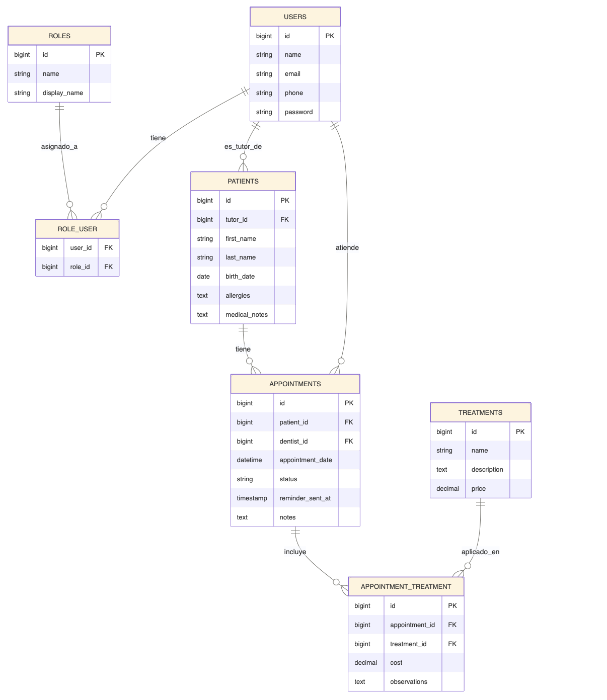

# 🦷 Clínica Dental Infantil

## Integrantes del Equipo
* **Ramirez Bautista Amisadai Zuriel**
* **Santiago Vásquez David Osmar**

---

## Descripción de la Problemática

Las clínicas odontopediátricas enfrentan frecuentemente una alta tasa de ausentismo y cancelaciones imprevistas debido al olvido de las citas por parte de los padres de familia. A esta problemática se le suma la complejidad administrativa de gestionar manualmente el historial clínico infantil, asociar tutores a múltiples pacientes y la carencia de un canal de comunicación automatizado.

Este sistema resuelve dicha problemática mediante una API REST que centraliza la gestión de pacientes, citas y tratamientos, con notificaciones automáticas por SMS en los momentos clave del ciclo de vida de una cita.

---

## Tecnologías utilizadas

- **Backend:** Laravel 13 (PHP 8.5)
- **Base de datos:** MySQL 8.0
- **Autenticación:** Laravel Sanctum
- **Autorización:** Policies + Middleware de roles
- **Comunicación:** Twilio (SMS), Postfix (correo)
- **Servidor:** Nginx + PHP-FPM sobre Ubuntu 24.04 (DigitalOcean)
- **SSL:** Let's Encrypt (Certbot)
- **Pruebas de API:** Bruno

## Repositorios

- **Backend (este repo):** https://github.com/ZurielRamirez/Clinica-Dental-Infantil-Backend
- **Frontend:** https://github.com/ZurielRamirez/ProyectoFinal-Clinica-de-Odontopediatria-.git

## URLs del proyecto

- **API base:** https://api.dentalinfantiloaxaca.xyz/api
- **Frontend:** https://dentalinfantiloaxaca.xyz 

## Diagrama Entidad-Relación

El sistema maneja 7 tablas relacionadas: `users`, `roles`, `role_user` (N:M), `patients`, `appointments`, `treatments` y `appointment_treatment` (N:M).



**Relaciones principales:**
- Un usuario puede tener varios roles (`role_user`)
- Un tutor (`users`) tiene varios pacientes (`patients`)
- Un paciente tiene varias citas (`appointments`)
- Un odontopediatra (`users`) atiende varias citas
- Una cita puede tener varios tratamientos aplicados (`appointment_treatment`), con costo y observaciones propias por cita

## Credenciales de prueba

| Rol | Email | Contraseña |
|---|---|---|
| Administrador (developer) | admin@clinicadental.com | password123 |
| Odontopediatra | dentista@clinicadental.com | password123 |
| Tutor | tutor@gmail.com | password123 |

## Niveles de usuario

1. **admin** — acceso total, gestión de usuarios y CRUD de todos los módulos.
2. **dentist** — ve todos los pacientes (solo lectura), gestiona únicamente sus propias citas (confirmar, completar, cancelar, agregar notas).
3. **tutor** — ve y gestiona únicamente sus propios pacientes y las citas de estos; puede agendar citas y cancelarlas con al menos 24 horas de anticipación.

## Instalación local

```bash
git clone https://github.com/ZurielRamirez/Clinica-Dental-Infantil-Backend.git
cd Clinica-Dental-Infantil-Backend
composer install
cp .env.example .env
php artisan key:generate
```

Configura en `.env` la conexión a tu base de datos MySQL local (`DB_DATABASE`, `DB_USERNAME`, `DB_PASSWORD`) y las credenciales de Twilio si quieres probar el envío de SMS.

```bash
php artisan migrate
php artisan db:seed
php artisan serve
```

## Comunicación con el usuario

- **SMS (Twilio):** se envían mensajes reales automáticamente en 3 momentos:
  1. Al crear una cita (confirmación al tutor)
  2. Al cancelar una cita (aviso al tutor)
  3. 24 horas antes de la cita (recordatorio automático, vía `php artisan schedule:run` programado con cron en el VPS)

- **Correo electrónico (Postfix):** el servidor está configurado con Postfix, SPF y DKIM en el VPS. **El envío real de correo está bloqueado actualmente por política de DigitalOcean**, que restringe el puerto 25 saliente de forma permanente en todos sus droplets nuevos por prevención de spam. Se solicitó el desbloqueo mediante ticket de soporte (#12623010), el cual fue respondido negando la solicitud por política de la plataforma (ver evidencia en `docs/CorreoVPS.png`). La configuración de Postfix, SPF y DKIM está completa y correcta; el bloqueo es una limitación de infraestructura del proveedor, no de la aplicación.

## Pruebas con Bruno

La colección de pruebas está versionada en la carpeta `/bruno` de este repositorio, e incluye:
- Login y obtención de token
- Uso del token en rutas protegidas
- Casos de error: acceso denegado (403), datos inválidos (422), recurso no encontrado (404)

## Documentación adicional

- **Prototipo de Figma:** https://www.figma.com/design/UslAP1R0S6tCbOXo4dbeYQ/Proyecto_prograweb
- **Tablero de GitHub Projects:** https://github.com/users/ZurielRamirez/projects/3
- **Script de respaldo de base de datos:** `database/backup.sql`